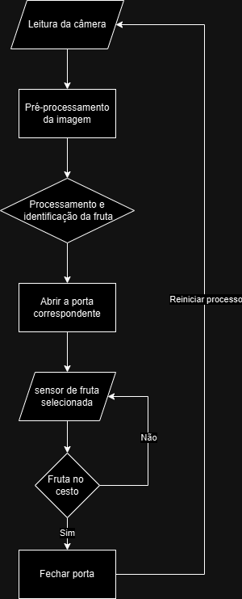
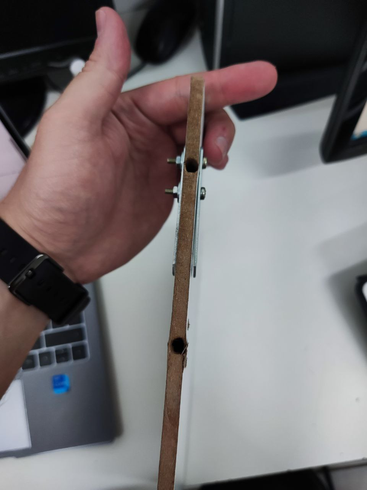
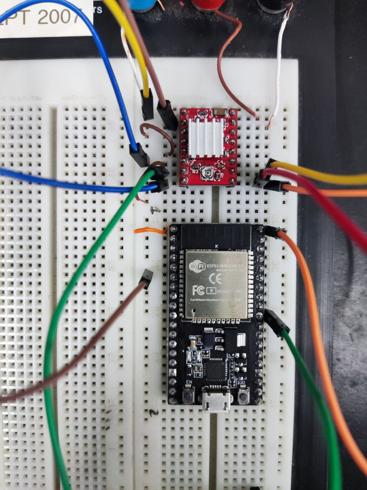
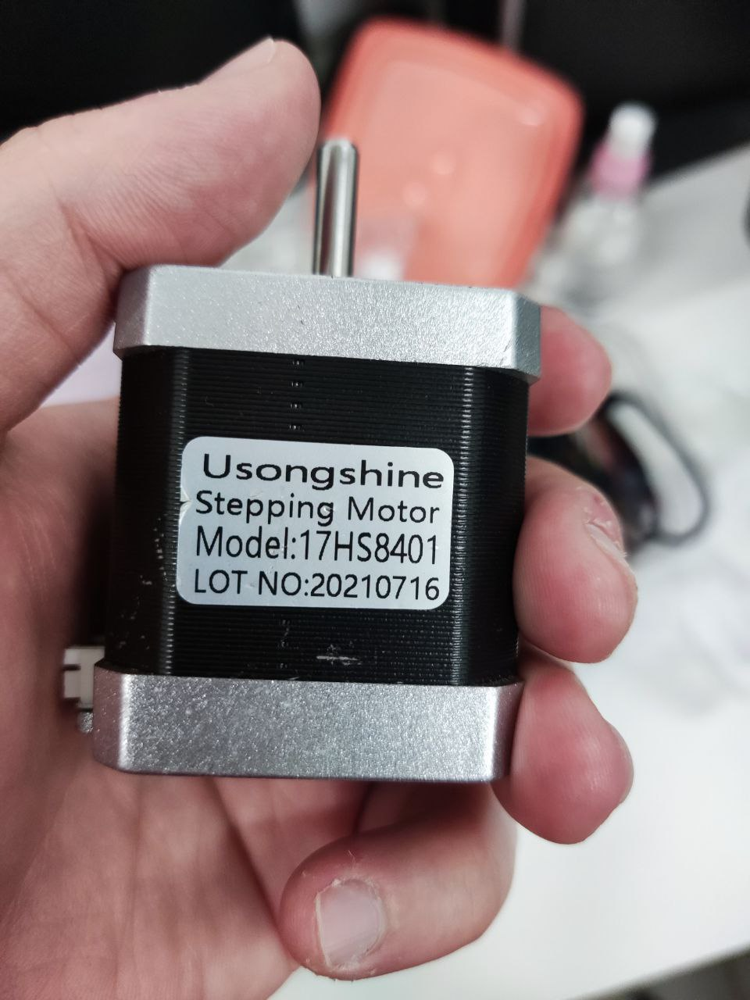

# Sistema de classificação de maçãs. Projeto Integrador 3 - Engenharia Eletrônica
Alunos:   
  * Kenner Marqueti Couto  
  * Brian Lesllie Silva Azevedo
  * João Victor Maciel da Veiga

## Cronograma

|Etapa 1|24/04||Etapa 2|15/05||Etapa 3|22/06||Etapa 4|24/07|
|---|---|---|---|---|---|---|---|---|---|---|
|S1|G1||S2|G2||S3|G3||S4|G4|
| Definição geral do funcionamento | Introdução do projeto || Capturar imagens no esp | Código relativo ao funcionamento da camera || Testes de acionamentos | Documentação dos testes de acionamento || Validar treinamento do processamento de imagem (finalizar treinamento do modelo) | Documentar o treinamento |
| Esboço inicial da parte mecânica | Justificativa/motivação || Verificar funcionamento inicial da parte eletrônicamecânica | Justificativa da escolha de base de dados || Iniciar treinamento do processamento de imagem e obtenção de resultados preliminares | Resultados iniciais do treinamento do modelo de aprendizagem || Ajustes finais para sincronização do sistema || Documentar resultados da separação das frutas e assertividade | Documentar estrutura eletromecânica realizada |
| Levantamento e listagem do hardware | Pesquisa do estado da arte (revisão de literatura e outras referências) || Análise e justificativa do processamento (rede neural ou imagem) | Sincronizar atuadores || | || Separar as frutas corretamente ||
| Diagrama de blocos |Listagem dos componentes || Selecionar processamento ou modelo de aprendizagem | Estrutura fisica da seletora || | || | |
||Esboço inicial da parte mecânica|| Seleção de base de dados | | || | || | |
||Levantamento e listagem do hardware || | || | || | |
||Diagrama de blocos com explicação || | || | || | |

## Introdução

Este projeto propõe o desenvolvimento de um robô seletor de maçãs, utilizando-se de um sistema embarcado composto por microcontrolador, câmera, atuadores, e sistemas acessórios (iluminação, alimentação, sensores). Através de processamento de imagens, o robô classifica e seleciona maçãs de diferentes tipos com base em suas características visuais. O objetivo deste projeto é oferecer a pequenos negócios uma alternativa de baixo custo aos equipamentos industriais com finalidade semelhante, tornando a tecnologia mais acessível a negócios de pequeno porte.


## Justificativa

Com a crescente utilização de ferramentas de visão computacional na indústria e comércio, nota-se o uso destes na seleção de mercadorias. Observando a forma com que a seleção de frutas é feita em indústria, constata-se o uso de sistemas complexos e caros.

Enquanto um produto de alto custo possa oferecer velocidade, robustez e precisão importantes para indústrias de larga escala, uma versão mais barata do sistema abre margem para aplicação por empresas menores, incluindo agricultura familiar, e com outras finalidades.

Com isso em mente a equipe visa o desenvolvimento de um sistema de seleção de frutas com visão computacional de hardware mais simples e barato, expandindo a possibilidades de uso para pequenos agricultores, supermercados, e outros empreendimentos de menor porte.

## Estado da arte

Antes do inicio de grandes projetos, é habitual realizar-se uma pesquisa sobre o estado da arte, levantando artigos acadêmicos, patentes e produtos relevantes ao objeto de projeto. Realizou-se então essa busca para sistemas de seleção de maçãs e outras frutas, com enfoque nos métodos utilizados para a classificação.

Constatou-se durante esta pesquisa que a vanguarda da tecnologia usa para além de imagens RGB capturadas por sensores CCD convencionais no espectro de luz visível, imagens de amplo espectro, análise espectroscópica, raio-x e mapeamento tridimensional. Sendo por exemplo a análise de infravermelho utilizada para detecção de infestações de insetos no interior da fruta e a região do infravermelho próximo utilizada para determinação da quantidade de açúcar presente no interior da fruta. [^1] [^2] [^3]

Entretanto estes tipos de análise dependem de componentes muito mais caros que o planejado para uso no projeto, o que inviabilizaria tanto o desenvolvimento devido aos custos quanto a comercialização do produto ao público alvo. Portanto a pesquisa passou a ter como enfoque publicações que utilizassem apenas análise de espectro visível. Estas análises costumam avaliar diferentes métodos computacionais para a classificação.

Os métodos observados podem ser classificados em 3 categorias: métodos clássicos, métodos de aprendizado de máquina não neurais, e métodos de aprendizado de máquina com redes neurais computacionais. Métodos clássicos de visão computacional como OTSU thresholding, Local Binary Patterns (LBP), e técnicas de manipulação de espaço de cor são utilizadas de forma complementar às técnicas de aprendizado de máquina ou em aplicações mais específicas, como por exemplo extração de texturas da casca das frutas. Alguns dos métodos de aprendizado de máquina recorrentes são: Support Vector Machines, Fuzzy Inference System, K-Nearest Neighbors, e Redes Neurais Convolucionais.[^3][^4][^5]

Destaca-se que a bibliografia consultada abrange diferentes sitemas de classificação, desde sistemas que passam a fruta por uma câmara de ambiente controlado e sensores diversos, até sistemas que avaliam a fruta ainda antes da colheita. Portanto é necessária uma profunda análise dos desempenhos e requisitos de cada algoritmo e dos requisitos específicos do projeto antes da escolha do método de classificação, visto que o custo computacional e o trabalho de desenvolvimento ou treinamento, assim como tamanho necessário da base de dados e sensibilidade a variações de ambiente ou amostras ruins na base de treinamento varia drásticamente.

## Princípio de funcionamento

O robô será composto por uma esteira inclinada, um sistema embarcado para aquisição de dados, processamento e acionamentos, além de portinholas controladas. Ao passar pelo sistema, a maçã é classificada de acordo com seu tipo, e a portinhola do recipiente para este respectivo tipo é acionada. Ao fim da esteira há uma abertura para onde irão objetos que não foram classificados em uma das categorias predefinidas.


## Componentes
Para o circuito foram levantados os seguintes componentes:
|Módulo|Quantidade|
|---|---|
|ESP32S3|1|
|Módulo de Câmera OV2640 ou OV5640|1|
|Motor de Passo|3|
|Motor DC|2|
|Esteira|1|
|IR Module(HW-201)|3|

Os motores de passo serão utilizados no acionamento das portas de seleção das frutas, já os motores DC farão a movimentação da esteira. A câmera vai capturar a imagem da fruta e o ESP32S3 fará o processamento da imagem e mandará o sinal de controle para os motores que acionarão as portas seletoras.

## Diagrama de Blocos

Como ideia inicial de projeto a esteira estará em funcionamento continuo e a fruta sempre vai sair alguma identificação seja correto ou não



## Links úteis

[USO DE VISÃO COMPUTACIONAL PARA RECONHECIMENTO DE IMAGENS DE FRUTAS EM IMAGENS RGB](https://repositorio.ufc.br/bitstream/riufc/64490/1/2022_tcc_jkopereira.pdf)

[Classificação de variedades de uma fruta: aplicação computacional em maçãs](https://sbic.org.br/wp-content/uploads/2023/10/pdf/CBIC_2023_paper009.pdf)

[Classificação e reconhecimento de frutos por processamento digital de imagem para previsão da produção](https://www.google.com/url?sa=t&source=web&rct=j&opi=89978449&url=https://ubibliorum.ubi.pt/bitstream/10400.6/7849/1/5700_11911.pdf&ved=2ahUKEwjA2_Tzh-CMAxUHF1kFHUCUKW4QFnoECBYQAQ&usg=AOvVaw3SoWpXwsvYiiUwejJIGhTX)


# Segunda Etapa

## Escolha do Processamento

Comparando-se os fatores requisitos de hardware, tempo de desenvolvimento, treinamento necessário, optou-se por utilizar o método de aprendizado de máquina de rede neural convolucional(CNN) para a classificação das imagens, pois para análise de imagens dentre os três métodos principais são Arvore aleatória de decisão ( Random Forest) , Máquina de Vetores de Suporte(SVM) e rede neural convolucional(CNN) os outros dois métodos precisam de parâmetros mais determinados para encontrar padrões enquanto CNN consegue achar os padrões mais facilmente poupando tempo para o treinamento e criação do algoritmo.

### Escolha do modelo

O modelo You Only look Once(YOLO) versão YOLOv5n (nano) foi escolhida por ser uma das mais leves e otimizadas em termos de desempenho e precisão. Essas versões do YOLOv5 são adequadas para rodar em dispositivos com recursos limitados, como o ESP32, sem comprometer a qualidade da classificação. Ao avaliar alternativas, consideramos dois outros modelos populares: o MobileNet SSD e o Tiny YOLOv4. O MobileNet SSD é um modelo também otimizado para dispositivos embarcados, com uma versão quantizada que é bem leve e rápida. No entanto, ele tende a ser menos preciso do que o YOLOv5, especialmente quando se trata de detectar múltiplos objetos em imagens complexas. O Tiny YOLOv4, por outro lado, é uma versão mais compacta do YOLOv4, mas não é tão otimizada quanto o YOLOv5n, além de ser mais difícil de adaptar ao ESP32 devido ao seu tamanho maior e à necessidade de mais otimizações.

### Escolha da Base de dados

Para o treinamento do modelo é necessária uma base de dados, que foi definido como a base disponível nesse  [link](https://www.kaggle.com/datasets/chrisfilo/fruit-recognition?select=Apple) essa base de dados já oferece uma coleção de imagens rotuladas que cobrem diversas variações de maçãs, o que é crucial para a tarefa de classificação de tipos de maçãs. A diversidade das imagens e a rotulagem correta de diferentes tipos de maçãs permitem que o modelo aprenda a identificar características específicas de cada variedade.


## Captura de Imagem
### Ferramentas Utilizadas

| Componente | Função |
|-----------|--------|
| ESP32-S | Controlador principal, responsável pela comunicação com a câmera|
| Câmera OV2640 | Sensor de imagem |
| Driver CH340 / Cabo USB-A para micro USB-B | Interface de programação e depuração serial entre o computador e o ESP32 |
| VSCode + Extensão ESP-IDF | Ambiente de desenvolvimento |
| Python + Flask | Servidor local que recebe e salva as imagens enviadas pelo ESP32 |

---

###  Funcionalidades Implementadas

- Inicialização da câmera OV2640
- Configuração dos pinos GPIO para comunicação com a câmera
- Conexão automática à rede Wi-Fi
- Captura de imagem a cada 5 segundos
- Codificação da imagem em formato JPEG
- Envio da imagem via HTTP POST para um servidor local
- Armazenamento da imagem no computador via servidor Python

###  Configuração do Ambiente de Desenvolvimento

### 1. Instalação do ambiente ESP-IDF

- Baixar e instalar o [ESP-IDF](https://docs.espressif.com/projects/esp-idf/en/latest/esp32/get-started/index.html).
- Configurar o ambiente no *VSCode* usando a extensão fornecida pelo fabricante *ESP-IDF*.

### 2. Configuração do projeto

No terminal do VSCode:

idf.py set-target esp32

idf.py menuconfig


Dentro do menuconfig, habilitar:

- *PSRAM*: Component config → ESP32-specific → Support for external, SPI-connected RAM
- *Wi-Fi*: Component config → Wi-Fi
- *Camera Driver*: Component config → Camera driver

Salvar e sair.

---

###  Código do ESP32 

O código realiza as seguintes funções:

1. *Inicializa a câmera*

```
esp_err_t init_camera() {
    esp_err_t err = esp_camera_init(&camera_config);
    if (err != ESP_OK) {
        ESP_LOGE(TAG, "Falha ao inicializar câmera");
        return err;
    }
    return ESP_OK;
}
```

2. *Conecta-se a uma rede Wi-Fi*

```
void wifi_init() {
    ESP_ERROR_CHECK(esp_netif_init());
    ESP_ERROR_CHECK(esp_event_loop_create_default());
    esp_netif_create_default_wifi_sta();

    wifi_init_config_t cfg = WIFI_INIT_CONFIG_DEFAULT();
    ESP_ERROR_CHECK(esp_wifi_init(&cfg));

    esp_event_handler_instance_t instance_any_id;
    esp_event_handler_instance_t instance_got_ip;
    ESP_ERROR_CHECK(esp_event_handler_instance_register(WIFI_EVENT,
                                                        ESP_EVENT_ANY_ID,
                                                        &wifi_event_handler,
                                                        NULL,
                                                        &instance_any_id));
    ESP_ERROR_CHECK(esp_event_handler_instance_register(IP_EVENT,
                                                        IP_EVENT_STA_GOT_IP,
                                                        &wifi_event_handler,
                                                        NULL,
                                                        &instance_got_ip));

    wifi_config_t wifi_config = {
        .sta = {
            .ssid = WIFI_SSID,
            .password = WIFI_PASS,
            .threshold.authmode = WIFI_AUTH_WPA2_PSK,
        },
    };
    ESP_ERROR_CHECK(esp_wifi_set_mode(WIFI_MODE_STA));
    ESP_ERROR_CHECK(esp_wifi_set_config(ESP_IF_WIFI_STA, &wifi_config));
    ESP_ERROR_CHECK(esp_wifi_start());
}
```

3. *Captura uma imagem a cada 5 segundos*

```
        camera_fb_t *fb = esp_camera_fb_get();
        if (!fb) {
            ESP_LOGE(TAG, "Falha ao obter frame da câmera");
            continue;
        }
        ...
        vTaskDelay(pdMS_TO_TICKS(5000));// A cada 5 segundos
```

4. *Envia a imagem via HTTP POST para um servidor local*

```
void send_http_post(uint8_t *image_data, size_t image_len) 
```

### Servidor Python (server.py)

Roda um servidor simples com *Flask* para receber e salvar a imagem.

### Dependências:

pip install flask


###  Passo a Passo para Execução

### 1. Ligar o ESP32-CAM

- Conectar o ESP32-CAM ao computador via cabo USB.
- Selecionar a porta no VSCode.

### 2. Compilar e gravar o firmware

No terminal do VSCode:

idf.py build

idf.py flash

idf.py monitor


### 3. Executar o servidor Python

Em outro terminal:

python server.py


### 4. Verificar a imagem recebida

Após alguns segundos, o ESP32 enviará uma imagem JPEG, que será salva como:


imagem_recebida.jpg


no mesmo diretório onde o script server.py está sendo executado.

## Testes iniciais da parte eletromecânica.


Para o teste da parte eletromecânica, confeccionou-se uma das portas do sistema em MDF. Efetuou-se 4 furos nas laterais, à fim de agirem como eixo pivotante. Mais próximos a limite superior são os furos inicialmente projetados, e os furos inferiores foram realizados para, caso o torque do motor seja insufuciente, reduza-se a alavanca, e portanto, a exigência deste parâmetro. Para fixação do eixo no mdf de forma a evitar a destruição da porta, utilizou-se duas chapas de metal parafusadas de forma a comprimir a peça.



Para os testes do motor de passo *NEMA 17* de código *17HS8401* foi utilizado o ESP32S, um driver *HR4988SQ*, e um driver *DRV8825*, além de fontes de bancada de tensão variável com limitador de corrente ajustável. A atuação com o driver DVR8825 inicialmente funcionou, porém após a troca de um cabo de fonte o driver passou a consumir 150 mA de corrente em seus pinos de controle. Mesmo substituindo por um modelo novo, não obteve-se sucesso em utilizá-lo para o controle. 





Considerando-se em uma aproximação o peso da porta de 200g e o torque do motor de 5,2 Kgf.cm e uma alavanca de 24 cm o motor seria suficiente com pouca margem. Porém esta aproximação considera que o peso estaria todo na ponta da alvanca e não distribuído ao longo de seu comprimento, gerando assim uma margem que prevê o motor como adequado.

Como teste alternativo para a capacidade do motor de suportar o peso alimentou-se o motor diretamente na fonte, limitando sua corrente inicialmente me 400 mA (total para ambas as bobinas) e de forma incremental até 2 A (total para ambas as bobinas). Com valores menores de corrente o motor nao consegue manter a chapa paralela ao chão pivotando em torno do furo mais próximo à extremidade, porém, com 1,8 A o motor se mostrou suficiente.

Relizou-se então testes com o driver *HR4988SQ*, este driver funcionou corretametne, porém apesar de ajustar o trimpot limitador de corrente, este driver não forneceu mais de 400 mA ao motor, o que foi insuficiente para mater o motor travado e perpendicular ao chão. Utilizando, entretanto, o furo mais central, o motor conseguiu mover a porta sem dificuldades. Foram testadas mudanças no microstep na tentativa de angariar mais torque, porém mesmo assim não foi possível utilizar o furo superior.


Testou-se a esteira alimentando-a diretamente com 12V. A esteira funcionou bem sem comentários adicionais.


## Referências

[^1]: Borba, K. R., Sapelli, K. S., Spricigo, P. C., & Ferreira, M. D. (2017). Near infrared spectroscopy sugar quantification in intact orange. Citrus Research & Technology, 38(2). https://doi.org/10.4322/crt.ICC118

[^2]: Bahareh Jamshidi, Ability of near-infrared spectroscopy for non-destructive detection of internal insect infestation in fruits: Meta-analysis of spectral ranges and optical measurement modes, Spectrochimica Acta Part A: Molecular and Biomolecular Spectroscopy, Volume 225, 2020, 117479,ISSN 1386-1425, https://doi.org/10.1016/j.saa.2019.117479.

[^3]: Boulley, L et al. 2015. Near-infrared optical spectroscopy of sugar-based mixtures – A snapshot to identify issues of influence. In: Längle, T et al (eds.), OCM 2015 – 2nd International Conference on Optical Characterization of Materials, March 18th – 19th, 2015, Karlsruhe, Germany : Conference Proceedings. Karlsruhe: KIT Scientific Publishing. https://doi.org/10.58895/ksp/1000044906-3 

[^4]: Ji, W.; Wang, J.; Xu, B.; Zhang, T. Apple Grading Based on Multi-Dimensional View Processing and Deep Learning. Foods 2023, 12, 2117. https://doi.org/10.3390/foods12112117

[^5]: Naik, Sapan & Patel, Bankim. (2017). Machine Vision based Fruit Classification and Grading - A Review. International Journal of Computer Applications. 170. 22-34. 10.5120/ijca2017914937. 
