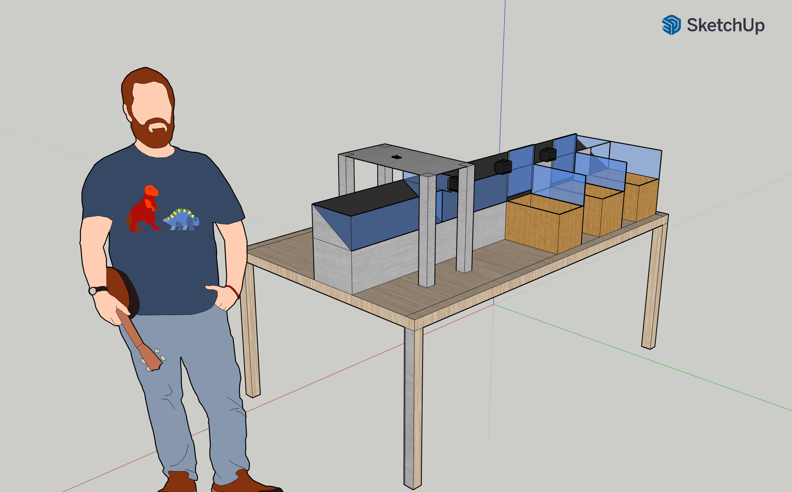
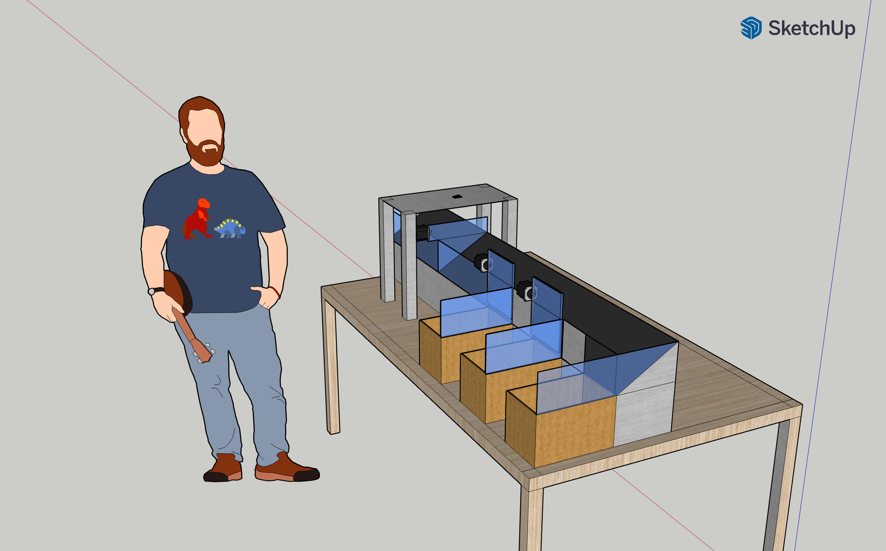

# Sistema de classificação de maçãs. Projeto Integrador 3 - Engenharia Eletrônica
Alunos:   
  * Kenner Marqueti Couto  
  * Brian Lesllie Silva Azevedo
  * João Victor Maciel da Veiga

## Cronograma

|Etapa 1|24/04||Etapa 2|15/05||Etapa 3|22/06||Etapa 4|24/07|
|---|---|---|---|---|---|---|---|---|---|---|
|S1|G1||S2|G2||S3|G3||S4|G4|
| Definição geral do funcionamento | Introdução do projeto || Capturar imagens no esp | Código relativo ao funcionamento da camera || Testes de acionamentos | Documentação dos testes de acionamento || Validar treinamento do processamento de imagem (finalizar treinamento do modelo) | Documentar o treinamento |
| Esboço inicial da parte mecânica | Justificativa/motivação || Verificar funcionamento inicial da parte eletrônicamecânica | Justificativa da escolha de base de dados || Iniciar treinamento do processamento de imagem e obtenção de resultados preliminares | Resultados iniciais do treinamento do modelo de aprendizagem || Ajustes finais para sincronização do sistema || Documentar resultados da separação das frutas e assertividade | Documentar estrutura eletromecânica realizada |
| Levantamento e listagem do hardware | Pesquisa do estado da arte (revisão de literatura e outras referências) || Análise e justificativa do processamento (rede neural ou imagem) | Sincronizar atuadores || | || Separar as frutas corretamente ||
| Diagrama de blocos |Listagem dos componentes || Selecionar processamento ou modelo de aprendizagem | Estrutura fisica da seletora || | || | |
||Esboço inicial da parte mecânica|| Seleção de base de dados | | || | || | |
||Levantamento e listagem do hardware || | || | || | |
||Diagrama de blocos com explicação || | || | || | |

## Introdução
Este projeto propõe o desenvolvimento de um robô seletor de maçãs, utilizando-se de um sistema embarcado composto por microcontrolador, câmera, atuadores, e sistemas acessórios (iluminação, alimentação, sensores). Através de processamento de imagens, o robô classifica e seleciona maçãs de diferentes tipos com base em suas características visuais.

## Justificativa

Com a crescente utilização de ferramentas de visão computacional na indústria e comércio, nota-se o uso destes na seleção de mercadorias. Observando a forma com que a seleção de frutas é feita em indústria, constata-se o uso de sistemas complexos e caros.

Enquanto um produto de alto custo possa oferecer velocidade, robustez e precisão importantes para indústrias de larga escala, uma versão mais barata do sistema abre margem para aplicação por empresas menores, incluindo agricultura familiar, e com outras finalidades.

Com isso em mente a equipe visa o desenvolvimento de um sistema de seleção de frutas com visão computacional de hardware mais simples e barato, expandindo a possibilidades de uso para pequenos agricultores, supermercados, e outros empreendimentos de menor porte.

## Estado da arte

Antes do inicio de grandes projetos, é habitual realizar-se uma pesquisa sobre o estado da arte, levantando artigos acadêmicos, patentes e produtos reevantes ao objeto de projeto. Realizou-se então essa busca para sistemas de seleção de maçãs e outras frutas, com enfoque nos métodos utilizados para a classificação.

Constatou-se durante esta pesquisa que a vanguarda da tecnologia usa para além de imagens RGB capturadas por sensores CCD convencionais no espectro de luz visível, imagens de amplo espectro, análise espectroscópica, raio-x e mapeamento tridimensional. Sendo por exemplo a análise de infravermelho utilizada para detecção de infestações de insetos no interior da fruta e a região do infravermelho próximo utilizada para determinação da quantidade de açúcar presente no interior da fruta. [^1] [^2]

Entretanto estes tipos de análise dependem de componentes muito mais caros que o planejado para uso no projeto, o que inviabilizaria tanto o desenvolvimento devido aos custos quanto a comercialização do produto ao público alvo. Portanto a pesquisa passou a ter como enfoque publicações que utilizassem apenas análise de espectro visível. Estas análises costumam avaliar diferentes métodos computacionais para a classificação.

Os métodos observados podem ser classificados em 3 caegorias: métodos clássicos, métodos de aprendizado de máquina não neurais, e métodos de aprendizado de máquina com redes neurais computacionais. Métodos clássicos de visão computacional como OTSU thresholding, Local Binary Patterns (LBP), e técnicas de manipulação de espaço de cor são utilizadas de forma complementar às técnicas de aprendizado de máquina ou em eplicações mais específicas, como por exemplo extração de texturas da casca das frutas. Alguns dos métodos de aprendizado de máquina recorrentes são: Support Vector Machines, Fuzzy Inference System, K-Nearest Neighbors, e Redes Neurais Convolucionais.[^3][^4]

Destaca-se que a bibliografia consultada abrange diferentes sitemas de classificação, desde sistemas que passam a fruta por uma câmara de ambiente controlado e sensores diversos, até sistemas que avaliam a fruta ainda antes da colheita. Portanto é necessária uma profunda análise dos desempenhos e requisitos de cada algoritmo e dos requisitos específicos do projeto antes da escolha do método de classificação, visto que o custo computacional e o trabalho de desenvolvimento ou treinamento, assim como tamanho necessário da base de dados e sensibilidade a variações de ambiente ou amostras ruins na base de treinamento varia drásticamente.

## Princípio de funcionamento

O sistema consiste em uma esteira inclinada, responsável por transportar as frutas pelo sistema, ESP32S3 e módulo de câmera, responsáveis pela captura e processamento das imagens, bem como controle de atuadores, e por fim, portas controladas por motores de passo, que se abrem para permitir que as frutas caiam em caixas de acordo com o tipo de classificação.

## Componentes
Para o circuito foram levantados os seguintes componentes:
|Módulo|Quantidade|
|---|---|
|ESP32S3|1|
|Câmera|1|
|Motor de Passo|3|
|Motor DC|2|
|Esteira|1|

Os motores de passo serão utilizados no acionamento das portas de seleção das frutas, já os motores DC farão a movimentação da esteira. A câmera vai capturar a imagem da fruta e o ESP32S3 fará o processamento da imagem e mandará o sinal de controle para os motores que acionarão as portas seletoras.

## Referências

[^1]: Borba, K. R., Sapelli, K. S., Spricigo, P. C., & Ferreira, M. D. (2017). Near infrared spectroscopy sugar quantification in intact orange. Citrus Research & Technology, 38(2). https://doi.org/10.4322/crt.ICC118

[^2]: Boulley, L et al. 2015. Near-infrared optical spectroscopy of sugar-based mixtures – A snapshot to identify issues of influence. In: Längle, T et al (eds.), OCM 2015 – 2nd International Conference on Optical Characterization of Materials, March 18th – 19th, 2015, Karlsruhe, Germany : Conference Proceedings. Karlsruhe: KIT Scientific Publishing. https://doi.org/10.58895/ksp/1000044906-3 

[^3]: Ji, W.; Wang, J.; Xu, B.; Zhang, T. Apple Grading Based on Multi-Dimensional View Processing and Deep Learning. Foods 2023, 12, 2117. https://doi.org/10.3390/foods12112117

[^4]: Naik, Sapan & Patel, Bankim. (2017). Machine Vision based Fruit Classification and Grading - A Review. International Journal of Computer Applications. 170. 22-34. 10.5120/ijca2017914937. 

[^5]: Bahareh Jamshidi, Ability of near-infrared spectroscopy for non-destructive detection of internal insect infestation in fruits: Meta-analysis of spectral ranges and optical measurement modes, Spectrochimica Acta Part A: Molecular and Biomolecular Spectroscopy, Volume 225, 2020, 117479,ISSN 1386-1425, https://doi.org/10.1016/j.saa.2019.117479.

## Links úteis

[USO DE VISÃO COMPUTACIONAL PARA RECONHECIMENTO DE IMAGENS DE FRUTAS EM IMAGENS RGB](https://repositorio.ufc.br/bitstream/riufc/64490/1/2022_tcc_jkopereira.pdf)

[Classificação de variedades de uma fruta: aplicação computacional em maçãs](https://sbic.org.br/wp-content/uploads/2023/10/pdf/CBIC_2023_paper009.pdf)

[Classificação e reconhecimento de frutos por processamento digital de imagem para previsão da produção](https://www.google.com/url?sa=t&source=web&rct=j&opi=89978449&url=https://ubibliorum.ubi.pt/bitstream/10400.6/7849/1/5700_11911.pdf&ved=2ahUKEwjA2_Tzh-CMAxUHF1kFHUCUKW4QFnoECBYQAQ&usg=AOvVaw3SoWpXwsvYiiUwejJIGhTX)
