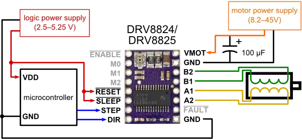

# Terceira Etapa

## Estrutura física da seletora

Utilizou-se como material uma combinação de MDF, MDP e madeira natural para criar a estrutura composta por:

- 2 portas móveis atuadas por motores de passo e sua estrutura de suporte.
- 1 suporte tipo mesa para fixação da câmera e restante da parte eletrônica.
- 1 cancela para reter o avanço das frutas sub a câmera, possibilitanto girar a fruta.

Todo o material foi doado ou reaproveitado. Encontrou-se inicialmente dificuldades devido à inexperiência com trabalho em madeira, porém significativas evoluções ocorreram. A primeira mesa montada pela equipe, vista na imagem abaixo, ficou bastante torta e pouco estável. Esta mesa foi refeita, com outro material e utilizando-se de outras técnicas de fixação e de design, gerando um resultado muito mais bem acabado e estável.


A nova mesa pode ser vista na imagem abaixo, além de uma estrutura mais reforçada, o método de fixação deixou de ser pregos e passou a ser parafusos transpassados e porcas.


Foram também feitas as portas que serão responsáveis por impedir que as maçãs caiam nos compartimentos errados. Essas portas podem ser vistas na imagem abaixo.


## Treinamento e implementação de modelo

### Treinamento inicial

Utilizando-se do google colab treinou-se um modelo YOLOv 5S com a base de dados selecionada na etapa 2, em testes utilizando imagens de alta resolução e sem pré-processamento algum o modelo apresentou uma alta taxa de falsos positivos, o modelo não foi testado com muitas imagens ou com pré-processamento. O modelo levou 11 ms para classificar uma imagem de alta resolução em um computador desktop.

Um breve snippet do trinamento pode ser visto abaixo

```


```

### Implementação

Por não apresentar resultados satisfatórios este modelo não foi implementado no ESP, optando-se por implementar um modelo pré treinado para verificar a viabiliade do ESP escolhido para a classificação.

Implementou-se então um modelo pré treinado que classifica parafusos em 3 categorias: pequeno, grande e preto. O modelo foi pré treinado com 300 epochs, sendo apenas um modelo exemplo, ele foi capaz de distinguir parafusos de outros objetos, e apresentou performance satisfatória para os testes iniciais em classificar por tamanho. O modelo pré treinado levou 1,4 segundos para classificar uma imagem, indicando que ou otimizações serão necessárias, ou será necessário o uso de hardware mais potente para o produto final.

Uma breve demonstração pode ser vista abaixo.


## Teste dos acionamentos

Para acionar os motores de passo foi usado o driver DRV8825 foi usado o esquemático de base mostrado na imagem abaixo:

[^1]

Utilizando funcões em C para definir os acionamentos:

```
void abre_porta(void){
    int direction = 1;

    // Run in current direction
    gpio_set_level(PIN_DIR_1, direction);  // Set direction
    ledc_set_duty(LEDC_LOW_SPEED_MODE, LEDC_CHANNEL_1, 512); // Resume PWM
    ledc_update_duty(LEDC_LOW_SPEED_MODE, LEDC_CHANNEL_1);

    vTaskDelay(pdMS_TO_TICKS(400));  // Run for 1 second

    // Stop PWM (motor idle)
    ledc_set_duty(LEDC_LOW_SPEED_MODE, LEDC_CHANNEL_1, 0);
    ledc_update_duty(LEDC_LOW_SPEED_MODE, LEDC_CHANNEL_1);
}
void fecha_porta(void){
    int direction = 0;

    // Run in current direction
    gpio_set_level(PIN_DIR_1, direction);  // Set direction
    ledc_set_duty(LEDC_LOW_SPEED_MODE, LEDC_CHANNEL_1, 512); // Resume PWM
    ledc_update_duty(LEDC_LOW_SPEED_MODE, LEDC_CHANNEL_1);

    vTaskDelay(pdMS_TO_TICKS(400));  // Run for 1 second

    // Stop PWM (motor idle)
    ledc_set_duty(LEDC_LOW_SPEED_MODE, LEDC_CHANNEL_1, 0);
    ledc_update_duty(LEDC_LOW_SPEED_MODE, LEDC_CHANNEL_1);
}
void libera_cancela(void){
    int direction = 1;

    // Run in current direction
    gpio_set_level(PIN_DIR_0, direction);  // Set direction
    ledc_set_duty(LEDC_LOW_SPEED_MODE, LEDC_CHANNEL_0, 512); // Resume PWM
    ledc_update_duty(LEDC_LOW_SPEED_MODE, LEDC_CHANNEL_0);

    vTaskDelay(pdMS_TO_TICKS(900));  // Run for 1 second

    // Stop PWM (motor idle)
    ledc_set_duty(LEDC_LOW_SPEED_MODE, LEDC_CHANNEL_0, 0);
    ledc_update_duty(LEDC_LOW_SPEED_MODE, LEDC_CHANNEL_0);

    vTaskDelay(pdMS_TO_TICKS(1500));  // Wait 1 second before changing direction

    // Toggle direction
    direction = !direction;

    // Run in current direction
    gpio_set_level(PIN_DIR_0, direction);  // Set direction
    ledc_set_duty(LEDC_LOW_SPEED_MODE, LEDC_CHANNEL_0, 512); // Resume PWM
    ledc_update_duty(LEDC_LOW_SPEED_MODE, LEDC_CHANNEL_0);

    vTaskDelay(pdMS_TO_TICKS(900));  // Run for 1 second

    // Stop PWM (motor idle)
    ledc_set_duty(LEDC_LOW_SPEED_MODE, LEDC_CHANNEL_0, 0);
    ledc_update_duty(LEDC_LOW_SPEED_MODE, LEDC_CHANNEL_0);
}

```


Para o acionamento da esteira foi usado o mosfet 2N7000 como driver para o mosfet IRF540N como mostrado no esquemático abaixo:


Dessa forma o acionamento fica invertido abaixo os comandos utilizados para controlar a esteira:
```
gpio_set_level(PIN_EST, 0); //Aciona esteira
gpio_set_level(PIN_EST, 1); //Para a esteira
```


## Sinconização dos atuadores

Com os acionamentos individuais funcionando foi feito uma rotina simulando a identifação de uma maçã e selecionando ela na porta 1, código da rotina abaixo:
```
        abre_porta();
        
        vTaskDelay(pdMS_TO_TICKS(100));
        gpio_set_level(PIN_EST, 0);
        libera_cancela();

        vTaskDelay(pdMS_TO_TICKS(1500));

        fecha_porta();
        gpio_set_level(PIN_EST, 1);
        vTaskDelay(pdMS_TO_TICKS(3000));
```
Abaixo os videos da rotina funcionando(primeiro somente a cancela e a porta segundo com a esteira junto):


## Referências
[^1]:https://www.marinostore.com/automacao/driver-motor-de-passo-drv8825

